# Alianza Wedding Studio · Gestión para wedding planners

Sistema de gestión para un estudio de wedding planning. Reemplaza las planillas, los grupos de WhatsApp y las carpetas sueltas: cada boda tiene su ficha con la pareja, los invitados, las mesas, el presupuesto, los proveedores, el checklist y el cronograma del día. La planner ve todas sus bodas en una agenda, los novios entran a un portal donde aprueban presupuestos y marcan sus tareas, y cada invitado confirma desde un link en el celular.

El diseño es el de una invitación: papel claro, nombres de los novios en Cormorant Garamond, rosa viejo y verde salvia para los anillos, y los números en DM Mono para que los montos y las cuentas regresivas se lean de un vistazo. Todo el texto está en español rioplatense y los montos en pesos argentinos.

Es una demo de portfolio de **Sync Solutions**: los datos son ficticios y las fechas se calculan desde hoy, así que la demo nunca queda vieja.

<p align="center">
  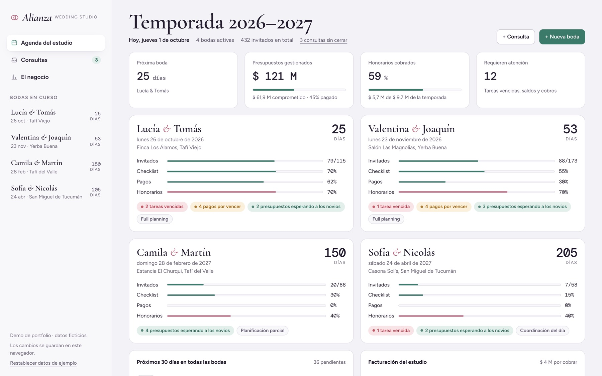
</p>

<p align="center">
  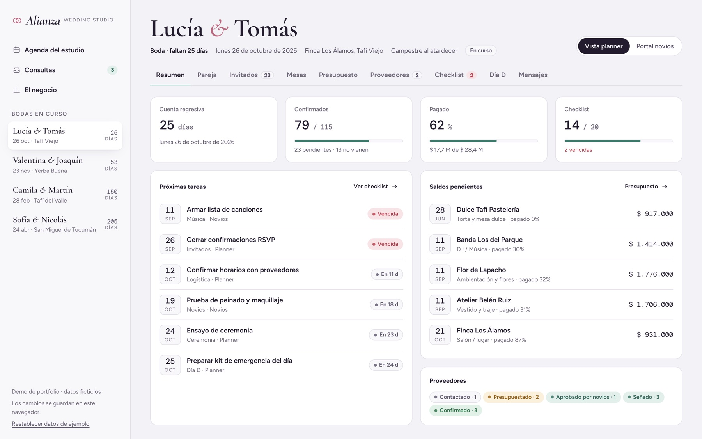
  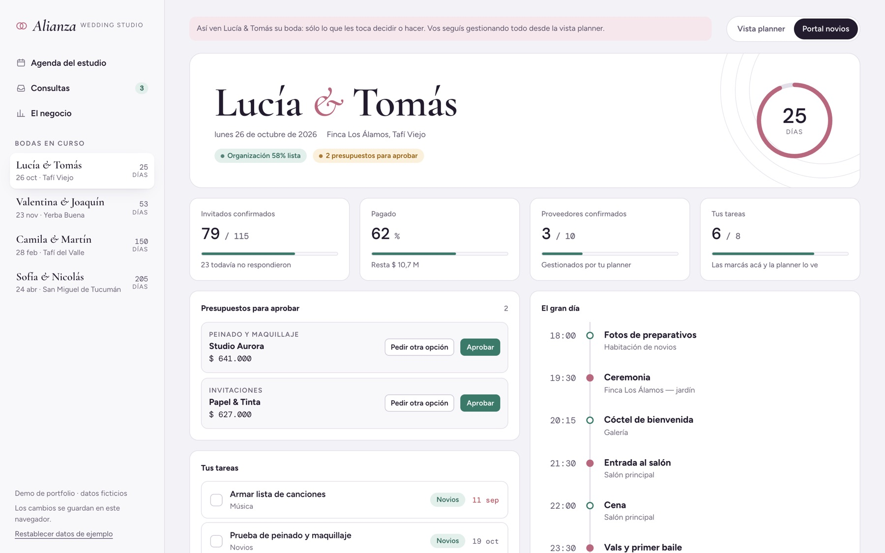
</p>

<p align="center">
  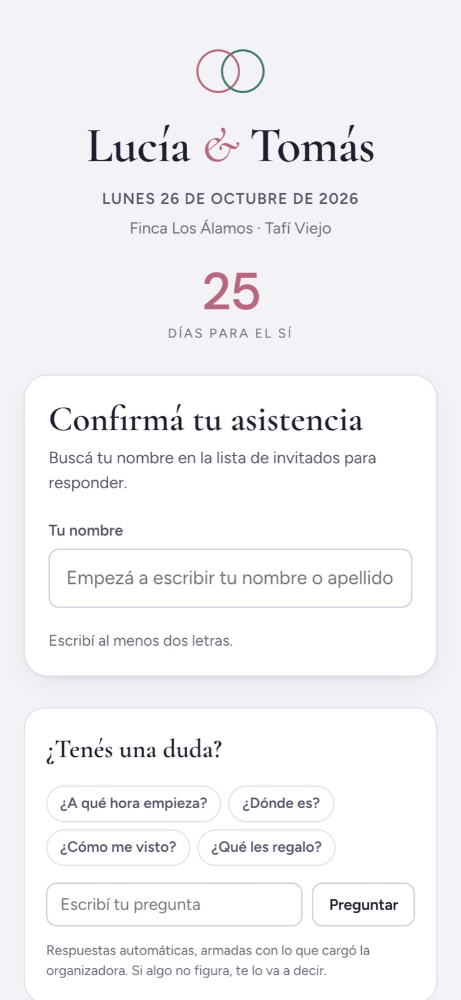
  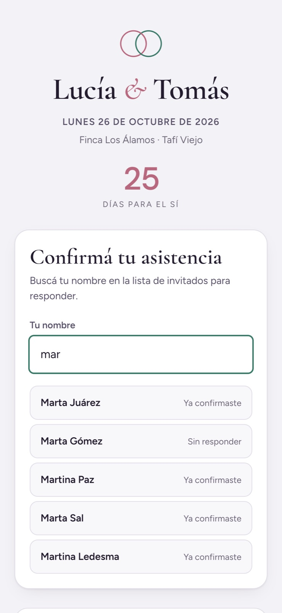
  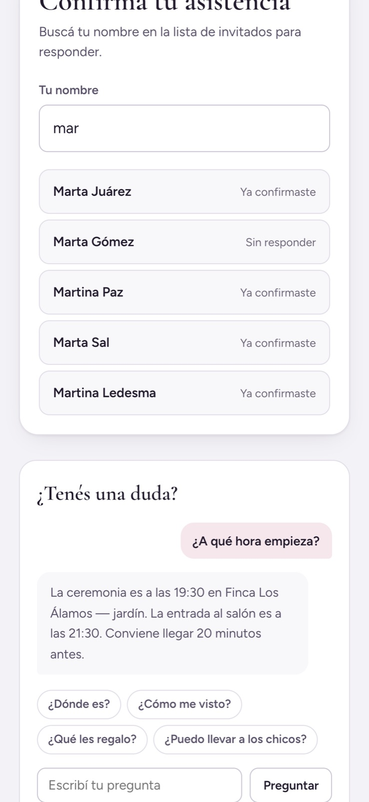
</p>

---

## Qué hace

### Para la planner

| | |
|---|---|
| **Agenda del estudio** | Todas las bodas en curso con cuenta regresiva, avance de invitados, checklist, pagos y honorarios. Avisa lo que está vencido y lo que vence en los próximos 30 días en todas las bodas. |
| **Consultas** | Las parejas que todavía no contrataron, con origen (Instagram, recomendación, web) y presupuesto pasado. Con un clic pasan a ser boda y arrancan con el checklist base, el cronograma del día y los proveedores a contactar. |
| **Ficha de la pareja** | Contacto de cada novio/a, cómo se conocieron, paleta, canción, testigos, reuniones agendadas, documentos (links al contrato o al plano del salón) y una bitácora con cada llamada, mail o pedido. |
| **Invitados** | Confirmaciones, menú especial (vegetariano, vegano, celíaco), chicos, acompañantes, búsqueda y filtros. Se exporta a CSV. |
| **Mesas** | Cada mesa con nombre propio y capacidad. Se sientan sólo los confirmados y avisa si una mesa se pasa. El plano se imprime. |
| **Presupuesto** | Comprometido contra pagado por categoría. Cada gasto tiene su plan de pagos (seña, segundo pago, saldo) con vencimientos. Se exporta a CSV. |
| **Proveedores** | Tablero por etapas: contactado → presupuestado → aprobado → señado → confirmado. Cuando los novios aprueban un presupuesto, el gasto se crea solo. |
| **Checklist** | Tareas de la planner y de los novios, por categoría, con las vencidas destacadas. |
| **Día D** | Cronograma del evento con los momentos clave, contactos de los proveedores y resumen para el catering (adultos, chicos y menús especiales). |
| **Mensajes** | Plantillas armadas con los datos de cada boda: recordar el RSVP, aviso de cuota, hoja de ruta para proveedores. Se abren en WhatsApp o en el correo con el texto listo; nada se manda solo. |
| **El negocio** | Los honorarios del estudio, aparte de la plata de los novios: contratado, cobrado, por cobrar, ticket promedio e ingresos por mes. |
| **Archivo** | Las bodas que ya pasaron salen del día a día sin perder la ficha. |

<p align="center">
  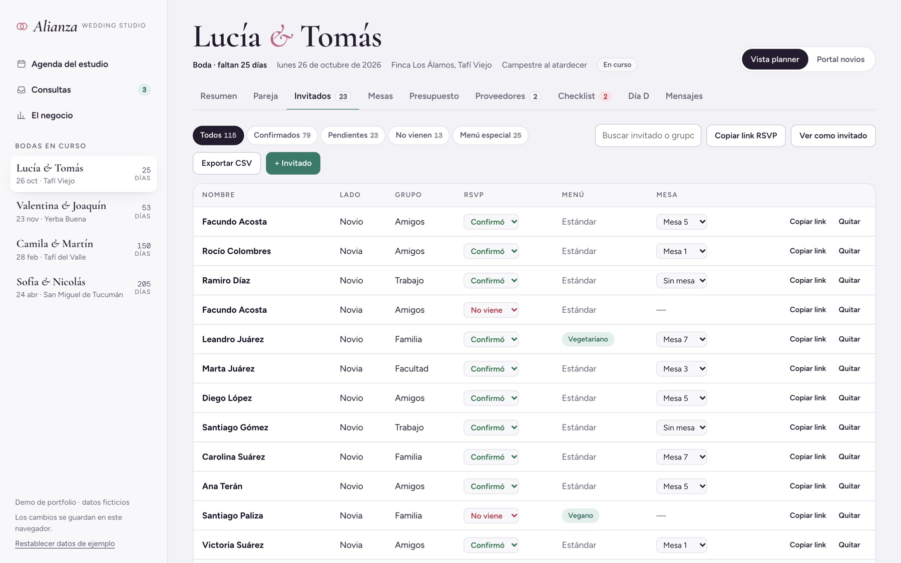
  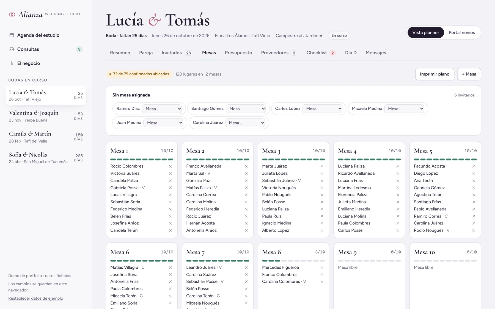
  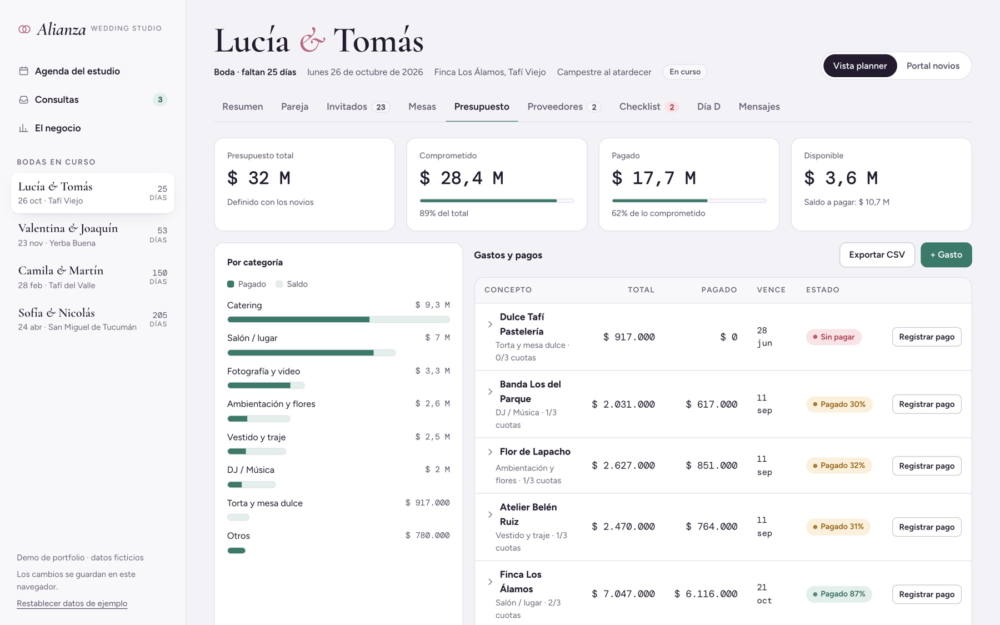
  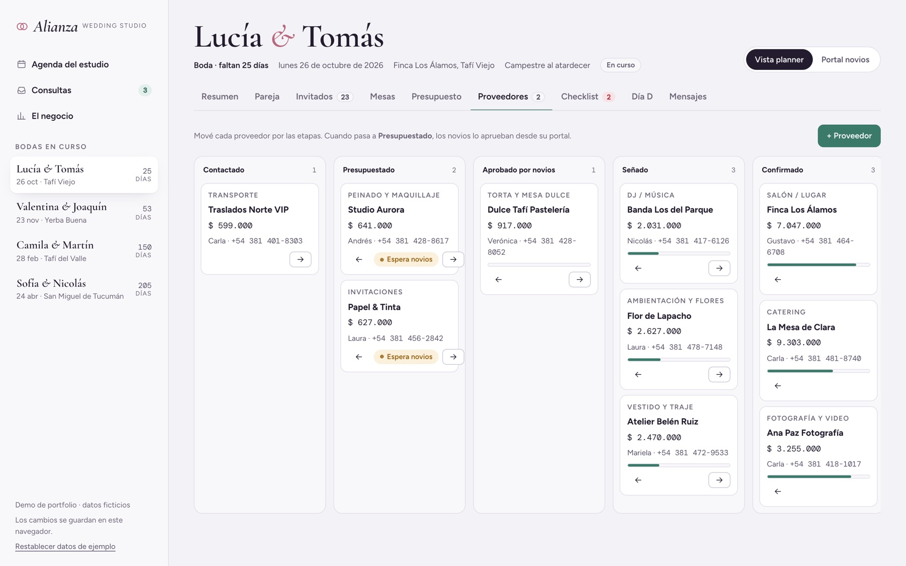
  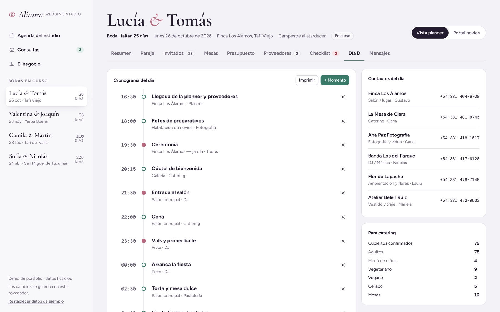
  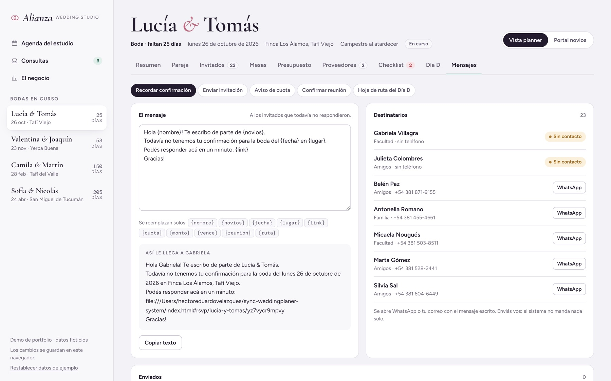
</p>

### Para los novios

| | |
|---|---|
| **Portal** | Una vista simple con la cuenta regresiva, cuánto se pagó y cuántos invitados confirmaron. Aprueban presupuestos o piden otra opción, marcan sus tareas y ven el cronograma del gran día. No ven la bitácora, los mensajes ni las notas internas de la planner. |

### Para los invitados

| | |
|---|---|
| **Confirmación por link** | El invitado abre el link en el celular, busca su nombre, responde, elige menú y suma acompañante si lo tiene habilitado. Con el link personal entra directo a su respuesta, sin buscar. La respuesta aparece en la lista de la planner. |
| **Asistente** | Responde dudas en la misma página: horario, cómo llegar, vestimenta, regalos, chicos, alojamiento. No usa inteligencia artificial: busca las palabras en lo que la planner cargó en la ficha, y si no sabe, lo dice. |

## Estructura

```
index.html                 página; monta todo en #app
config.js                  vacío = demo; con el backend, apunta el front a la API
css/styles.css             estilos (colores en :root) y versión para imprimir
js/
  app.js                   toda la app: datos de ejemplo, vistas, RSVP, asistente, mensajes
  store.js                 conexión opcional con el backend; sin configurar no hace nada
docs/                      capturas para este README
server/                    API opcional (Node + Express + PostgreSQL)
  migrations/              esquema de la base, versionado
  src/
    index.js               rutas: sesión, estado, portal de novios, RSVP público
    wedding-repo.js        guarda y lee cada boda en tablas normalizadas
    auth.js                contraseñas y sesiones
    db.js                  conexión y migraciones
    seed.js                crea la cuenta de la planner y carga datos
  test/                    pruebas de lógica y de punta a punta contra Postgres
```

El front no usa frameworks ni hace falta compilar nada: es HTML, CSS y JavaScript. Las tipografías vienen de Google Fonts.

## Verlo en tu compu

Abrí `index.html` con doble clic, o serví la carpeta:

```bash
npx serve .
# o con Python
python3 -m http.server 8000
```

Todo se guarda en el navegador. Para volver a los datos de ejemplo: **Restablecer datos de ejemplo**, abajo a la izquierda.

- **Portal de novios:** entrá a una boda y tocá **Portal novios** (o `#portal`).
- **Página del invitado:** en una boda, **Invitados → Ver como invitado** (o `#rsvp/lucia-y-tomas`).

## Con backend

El front anda solo. El servidor existe para cuando el sistema deja de ser demo: varias planners, novios entrando a su portal desde su casa e invitados confirmando desde su celular, con los datos en una base y no en un navegador.

```bash
cd server
npm install
cp .env.example .env        # completá DATABASE_URL y JWT_SECRET
npm run seed                # crea la cuenta de la planner
npm start                   # corre las migraciones y sirve todo en http://localhost:3000
```

Con el servidor arriba, la app pide usuario y contraseña y guarda contra la base. Qué cuida:

- **Nadie pisa a nadie.** Cada boda tiene un número de revisión. Si la planner guarda una versión vieja (porque los novios aprobaron algo en el medio), el servidor no pisa nada y la app avisa.
- **La respuesta del invitado gana.** Si un invitado confirma mientras la planner tiene la lista abierta, su respuesta no se pierde cuando ella guarda.
- **El link público no expone nada.** La página del invitado muestra nombre, fecha, lugar y cronograma. Nunca presupuestos, proveedores, teléfonos ni la lista de invitados: con el link general sólo se puede buscar un nombre.
- **Roles.** La planner ve y edita sus bodas; los novios sólo la suya, y sólo lo que les toca.

Endpoints, decisiones y variables de entorno en [`server/README.md`](server/README.md).

## Pruebas

```bash
cd server
npm test                    # lógica: sesiones, contraseñas, armado de SQL, merge de RSVP

# punta a punta contra un Postgres real (la base se borra entera al empezar)
createdb alianza_test
TEST_DATABASE_URL=postgres://localhost:5432/alianza_test npm run test:db
```

Las de punta a punta levantan el servidor y lo prueban por HTTP: migraciones, guardado con conflicto, permisos entre planners, el portal de novios y el RSVP público.

## Publicar

- **Sólo la demo:** es un sitio estático, sirve cualquier hosting (GitHub Pages, Netlify, Vercel). En GitHub Pages: *Settings → Pages → Deploy from a branch*, rama `main`, carpeta `/ (root)`.
- **Con backend:** Railway o Render para el servidor y una base administrada (Neon, Railway, Supabase). Con `PGSSL=require` y `CORS_ORIGIN` apuntando al dominio del front. El servidor ya sirve el front, así que alcanza con un solo servicio.

## Próxima etapa

1. **Deploy** del backend con base administrada.
2. **Recordatorios automáticos:** hoy los mensajes se abren con el texto listo y la planner toca enviar. Para que salgan solos (recordar el RSVP, avisar una cuota) hace falta la API de WhatsApp Business (Cloud API), con número propio y plantillas aprobadas por Meta, y Resend o Postmark para el mail. Es lo que más trabajo le ahorra a la planner.
3. **Instagram:** las consultas que entran por DM, directo a la vista de Consultas.
4. **Archivos de verdad** en la ficha; hoy los documentos son links.
5. **Endpoints por entidad**, para que dos personas editen la misma boda a la vez.
6. **Servidor MCP** sobre la misma API, para consultar y operar la agenda desde un agente.

## Créditos

- Diseño y desarrollo: Eduardo Velazquez · [Sync Solutions](https://instagram.com/sync.tuc).
- Tipografías: Cormorant Garamond, Figtree y DM Mono (SIL Open Font License).
- Datos de ejemplo: ficticios.

---
Sync Solutions · [@sync.tuc](https://instagram.com/sync.tuc) · [github.com/eduwavee](https://github.com/eduwavee)
